# 第三章 系統架構 (System Architecture)

本章說明本論文提出的系統架構。前一章（背景）介紹了 PianoMotion10M 作為手勢生成器與 Ramoneda 2022 作為指法決策的兩個獨立工作；本章主要 contribution 是把這兩個獨立元件**結合成一個可教學的 AI 鋼琴學習系統**，並解決一個 Phase A 系統暴露出來的設計問題：generative 手勢模型不適合擔任指法判官。

## 3.1 問題定義

理想的 AI 鋼琴學習系統需要回答兩個獨立的問題：

1. **示範問題 (Demonstration)**：給定一首樂曲，這首該怎麼彈？學生需要看到一段「正確示範」的手勢視頻
2. **判分問題 (Adjudication)**：學生實際彈奏時，他用的指法對不對？需要逐 onset 即時回饋

Phase A 系統 (memory: locked 2026-05-15) 使用 biomech v4 為兩個問題提供同一個答案——它生成 anatomically plausible 的手勢，並且系統從這個生成的手勢中**反推**指法去判斷學生對錯。但這個設計在實作驗證中暴露兩個結構性問題：

**問題一：Generative 模型的隨機性洩漏到判分**

biomech v4 是基於 PianoMotion10M (Liu et al., 2024) 的 diffusion 模型 + 後處理 IK，其生成過程包含 stochastic sampling。同一首 MIDI 在不同 inference 跑出來的指法軌跡並非 byte-for-byte 一致。如果以這個軌跡作為判分依據，學生即使彈對了標準指法，也可能被系統判錯——因為「標準答案」每次跑都不一樣。

**問題二：Motion-derived 指法包含 anatomical 不可能解**

從生成軌跡反推「哪根手指按了哪個鍵」需要 heuristic（如取按鍵瞬間 y 軸 downward-velocity 最大的指尖）。這個 heuristic 沒有強制「同一和弦不同音必須用不同指」的物理 constraint。實測中觀察到 [1, 1], [2, 2] 等同指同和弦的物理錯誤——這在真實鋼琴演奏中不可能發生。

## 3.2 Dual-Track Decoupling 架構

針對上述問題，本論文提出 **Dual-Track Decoupling**：把示範與判分職責徹底拆開，由兩個獨立的 deterministic 來源各自負責。整體架構如圖 3.1：



(若 SVG 未渲染，請參考 `figures/dual_track_architecture.mmd` 的 Mermaid 源碼或執行 `mmdc -i figures/dual_track_architecture.mmd -o figures/dual_track_architecture.svg` 生成。)

**Logic Track (判官)**：deterministic 指法決策器，採用 Ramoneda et al. 2022 預訓練 ArLSTM。輸入 MIDI 輸出 per-note (hand, finger) 決策，**與生成模型完全解耦**——同一 MIDI 永遠得到同一指法決策。

**Visual Track (渲染器)**：保留 biomech v4 作為手部姿態生成器，但**剝奪其判官角色**。它只負責「給定指法時，手該怎麼動」的視覺問題，不負責「該用哪根指」的決策問題。

## 3.3 Stage A：Logic Track

Stage A 的核心決策是：用什麼模型擔任 Logic Track？我們評估了四個候選來源（詳見第四章），並選定 Ramoneda 2022 ArLSTM 作為 default。本節說明該模型的整合方式。

### 3.3.1 Ramoneda 2022 ArLSTM 簡介

ArLSTM 是 score-to-fingering 任務的 sequence-to-sequence 模型：

- **Encoder**: 3-layer Bidirectional LSTM（input dim=1，僅 normalized MIDI pitch）
- **Decoder**: Autoregressive LSTM (in_size=64, hidden=64)，逐 note 輸出 finger logit
- **訓練資料**: ThumbSet (2,523 首部分標註) pre-train + PIG corpus (Nakamura 2014) 150 首人類專家完整標註 fine-tune
- **預訓練 checkpoint**: 來自原 paper 開源 repository (`PRamoneda/Automatic-Piano-Fingering`)，MIT 授權

本論文**不重訓練 ArLSTM**，直接使用原作者提供的 4 個預訓練 checkpoint (`{left,right}_{ArLSTM,ArGNN}.pth`)，方法級別與 SOTA 同步。

### 3.3.2 整合層 (`ramoneda_predict.py`)

寫一個 thin wrapper 把 Ramoneda 的 PyTorch 模型包裝成系統可用的 `predict(midi_path, hand, kind='ArLSTM') → (fingers[1..5], info[(time, pitch)])` API：

1. 讀取 MIDI，按 hand_split（中央 C）分手
2. 構建 graph edge_list (onset edges within chord, next edges between onset buckets)
3. 對 ArLSTM 路徑：用 `only_pitch` embedding，僅 MIDI pitch 正規化到 [0, 1]
4. 對 ArGNN 路徑：用 `emb_pitch` (Embedding(127, 64))
5. 共用 AR_decoder，無 teaching forcing，逐 note 貪婪解碼
6. 將 finger index (0..4) 映射到 thumb..pinky string

整合層延遲載入（lazy import），避免一般用戶（不使用 ArLSTM 時）也需要 torch 環境。

### 3.3.3 統一介面 (`webui/realtime/fingering_engine.py`)

對下游的 comparator / clip_recorder / broadcaster 而言，無論 Logic Track 採用哪個來源，輸入輸出 shape 必須統一。設計一個 `generate_fingering(midi_path, source='arlstm') → List[ExpectedOnset]` 函式：

```python
@dataclass
class ExpectedOnset:
    time: float
    pitch: int
    velocity: int
    expected_hand: str          # 'left' / 'right'
    expected_finger: str        # 'thumb' / 'index' / ...
    expected_finger_idx: int    # 0..4
    duration: float
```

`source='pianoplayer'` 與 `source='arlstm'` 兩個分支共用相同的 manual override 套用邏輯（每首歌可選擇性地 ship 一份 `songs/<song>_fingering.json` 覆寫指法）。新增 source 不影響任何下游 module。

## 3.4 Stage B：渲染 Pipeline 整合

Stage A 確立了正確的指法決策，但這個決策**只存在於評分邏輯裡**——學生看到的影片（PracticeScreen 上面的 "AI 教練示範"）是 biomech v4 渲染的，而 biomech v4 自己用 Viterbi cost-model 選指法 (參見 `biomechanical_fingering.py` 的 `ring_finger_stretch_multiplier=1.7` 等參數)。**學生看到的指法跟 judge 認可的指法是兩套**，這是 thesis 不能交待的矛盾。

Stage B 解決這個矛盾：把 ArLSTM 的指法決策注入到 biomech v4 的渲染流程中，讓 v4 退化為「給定指法時，手該怎麼動」的純 inverse-kinematics 引擎。

### 3.4.1 注入點

`simple_natural.py` 的渲染流程結構是：

```python
events = extract_events(midi)                     # → [(start_frame, frozenset(pitches))]
fmaps  = apply_<source>_fingering(events, ...)    # ← 這是注入點
right_poses, left_poses = solve_ik(events, fmaps) # 用 fmaps 驅動 IK
render_to_mp4(right_poses, left_poses)
```

`fmaps` 是一個 list of `{pitch: finger_name}` dict，每個對應一個 onset event。傳統實作 `apply_biomech_fingering` 內部跑 Viterbi cost-model 產生 fmaps。Stage B 增加 `apply_arlstm_fingering(events, is_right, midi_path)`，產生 shape 完全相同的 fmaps，但決策來源是 Ramoneda ArLSTM。

### 3.4.2 對齊機制

ArLSTM 輸出的是 (time_sec, pitch, finger) 三元組；渲染端的 events 是 (start_frame, pitches)。對齊以 frame index = round(time_sec × FPS) 為主，並容忍 ±5 frame 的 jitter（不同 MIDI parser 對時間戳的微小差異）。對於 ArLSTM 沒有覆蓋的 note（例如極稀少的 6+ note 和弦），fallback 到 biomech v4 的 Viterbi 結果。

### 3.4.3 渲染輸出

```bash
python simple_natural.py \
    --mp3 input_songs/Canon.mp3 --midi input_songs/Canon.mid \
    --fingering arlstm \
    --out_dir results/canon_arlstm --out_video results/canon_arlstm_kb.mp4
```

輸出 `canon_arlstm_kb.mp4` 是一個 1920×1080 H.264 影片，內容是「按照 ArLSTM 指法決策、由 biomech v4 anatomy 引擎渲染的鋼琴演奏」——這就是 Stage A 與 Visual Track 結合後的「正確教學示範」。

## 3.5 Stage C：UI 接軌

最後一步是把 Stage B 渲染好的「正確示範」接到學生實際看到的 React PracticeScreen UI 上。

### 3.5.1 修改點

- `webui/songs.json`：歌曲索引中每首的 `videoUrl` 從 `..._biomech_v4_kb.mp4` 更新為 `..._arlstm_kb.mp4`
- `webui/src/PracticeScreen.js`：
  - Hero video 的 fallback path 更新
  - UI 角落 brand label 從 `AI · biomech v4` 改為 `AI · ArLSTM × biomech v4`，一次顯示兩個 track 的角色
  - 程式碼註解全部更新

### 3.5.2 端到端驗證

在實際開啟 webui + runner 的端到端 smoke test 中，runner 啟動時的 log 確認 Logic Track 真實啟用 ArLSTM：

```
[ref] 344 expected onsets — Logic Track (Ramoneda ArLSTM)
```

10 個 onset 的 sample run 沒有錯誤，PracticeScreen 載入 ArLSTM 渲染的影片並接收 WebSocket feedback events 正常。

## 3.6 Pipeline Summary

整體 Stage A → B → C 資料流如圖 3.2：



把三個 Stage 整理成一張表：

| Stage | 輸入 | 輸出 | 主要實作檔 | Commit |
|---|---|---|---|---|
| A | MIDI | per-note (hand, finger) decision | `ramoneda_predict.py`, `fingering_engine.py` | `f7ebf8a` |
| B | MIDI + Stage A 決策 | rendered mp4 with prescribed fingering | `simple_natural.py --fingering arlstm` | `70e83c6` |
| C | Stage B 輸出 | PracticeScreen 顯示給學生看 | `webui/songs.json`, `webui/src/PracticeScreen.js` | `4a15909` |

整體流程：

```
MIDI ──┬─→ ArLSTM (Stage A) ──→ fingering decisions ──┐
       │                                              │
       └─→ biomech v4 anatomy engine ←────────────────┘
                            │
                            ▼
                 Stage B render → mp4
                            │
                            ▼
                 Stage C PracticeScreen
                            │
                            ▼
                       Student
```

第四章將對此架構中 Stage A 的判官選擇進行量化評估，驗證 ArLSTM 確實是合理的 default 選擇；第五章將描述 Stage B/C 的工程實作細節；第六章將描述使用者實際練琴時的閉環互動。
